# Bouncing Bumbles Sled Dog Kennel

Bouncing Bumbles is a small adventure and racing kennel in Fairbanks, AK.  You'll often see us training on the ADMA trails and in the White Mountains National Recreation Area.  The 2025/2026 race season will see us traveling all over North America and then finishing the season in April in the Brooks Range in Arctic Alaska.

1. [Race Plan](#plan)
2. [Team](#team)
3. [Previous Years](#previousyears)
3. [Contact](#contact)

## 2025-2026 Race Plan 

* December 20, 21 either
  * Solstice 50 - Two Rivers, AK
  * ~~Knik 100 - Knik, AK (Cancelled)~~
* January 10
  * Handle for Connor at Copper Basin - Glenallen, AK
* January 18 if the race happens
  *  Carbon Hill -  Whitehorse, YT
* January 23
  * Beargrease 120 - Duluth, MN
  * (Alternate) Eagle Cap 100 - Joseph, OR
* January 29 - depending on conditions and adjacent races
  * (Maybe) Warm Lake Stage Race 2x26 - Cascade, ID
  * (Maybe) Idaho Sled Dog Challenge 100 - McCall, ID
  * (Alternate) Caledonia Classic 50 - Fort St. James, BC
  * (Alternate) Northern Pines Middistance 30 - Iron River, WI
* February 7  
  * Gunflint Mail Run 60 - Grand Marais, MN
* February 13
  * Klondike Dog Derby 40 - Excelsior, MN  
  * (Alternate) Race to the Sky 100 - Lincoln, MT
  * (Alternate) Midnight Run 80 - Marquette, MI
* February 19-21
  * The Pas 10 dog - The Pas, MB
  * American Dog Derby - Ashton, ID
  * ~~Canadian Challenge 100~~
* March 1
  * Rec mushing in Yukon's Tombstones!
  * (Alternate) Yukon Odyssey 100 - Whitehorse, YT
  * (Alternate) Fur Rondy - Anchorage, AK
* March 5
  * The Percy - Dawson, YT
* March 20 if I'm motivated
  * Open North American Championship - My backyard in Fairbanks, AK
  * Tanana River Challenge Skijor

## Team

### Babe

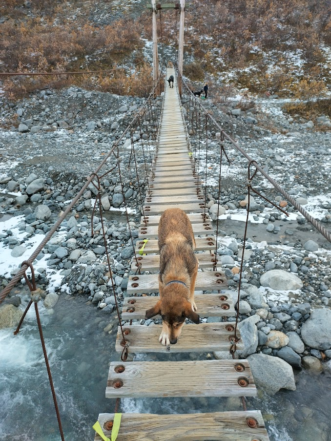

### Dolly

### Ember

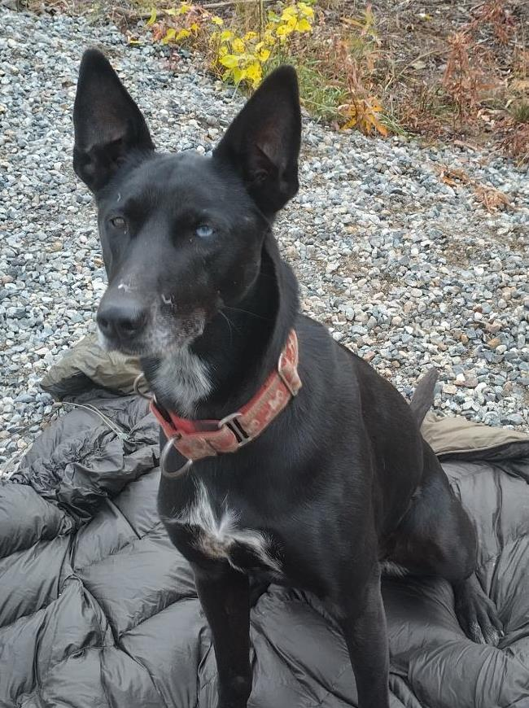

### Flecha

_Retired_

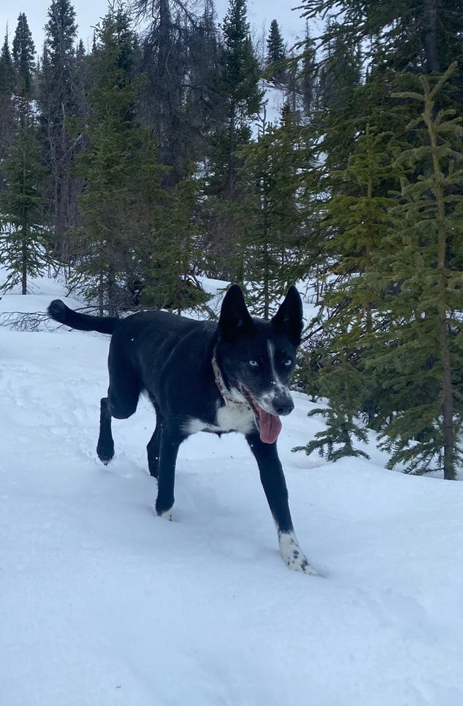

### Kyber

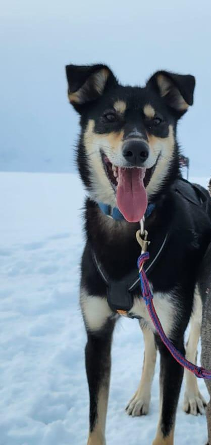

### Lexi

_Retired_

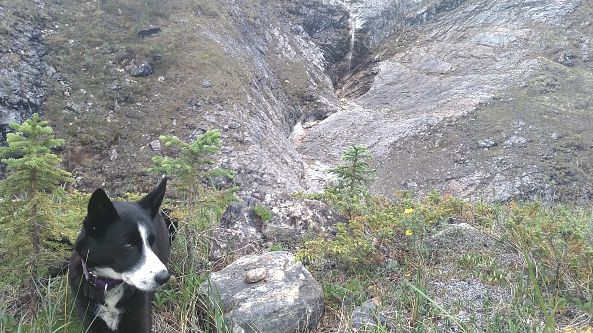

### Lizzy

### Lulu

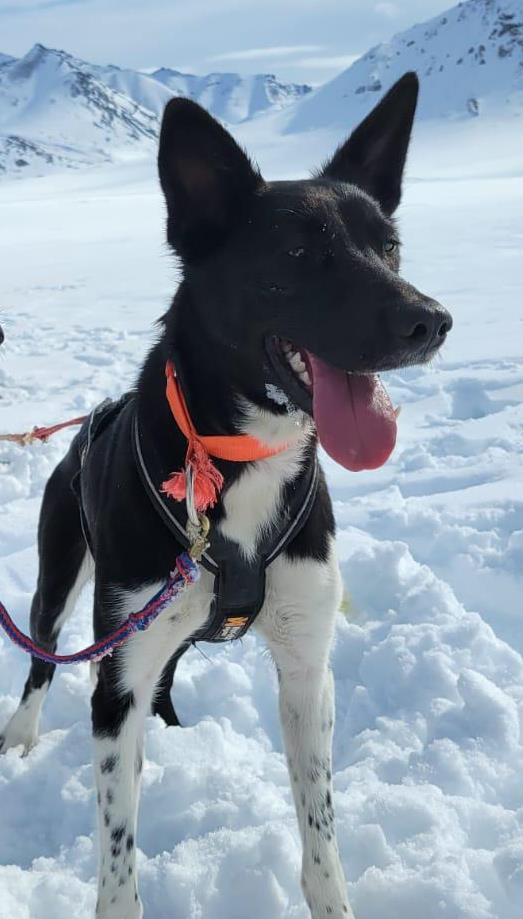

### Marlo

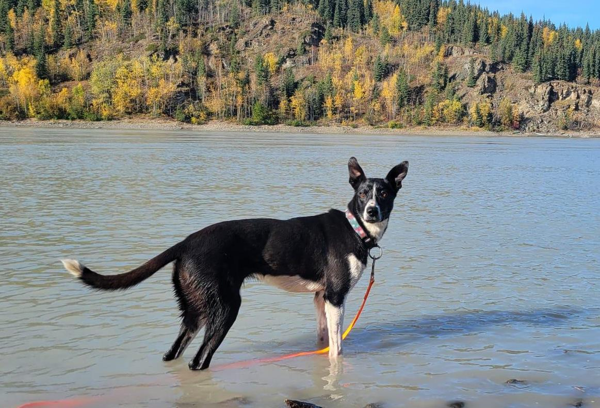

### Tiny 

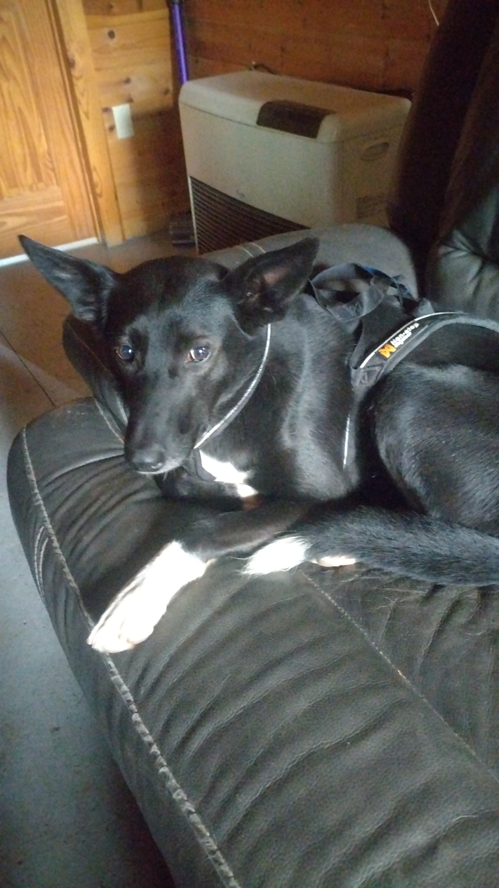

### Vicky 

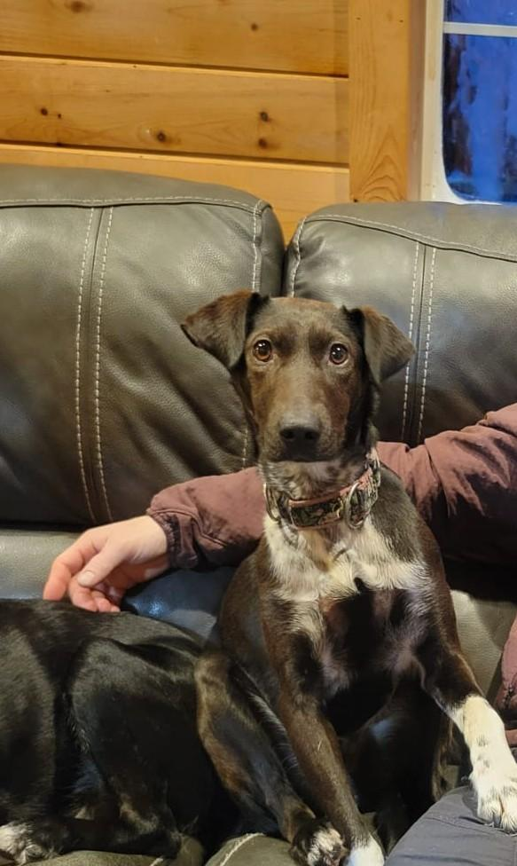

## Previous Years Results and Team

### 2024 - 2025 Season Results

Undefeated in mid-distance racing!

* Solstice 50 - Win (1/21)
* Carbon Hill 40 - Win (1/8)
* Caledonia Classic 50 - Win (1/5)
* Race to the Sky 100 - Win (1/20)
* The Pas 6 Dog
* The Pas 4 Dog
* Canadian Challenge 100 - Win (1/6)
* Yukon Odyssey 100 - Win (1/6)
* The Percy 100 - Win (1/5)
* Underdog 100 - Win (1/15)

### 2023 - 2024 Season Results

* ACE Race Doubles (100k) - Win
* Solstice 50 - Win
* Yukon Quest Canada 100 (km not miles due to weather) - Win
* Babe Southwick 10 Dog - 6/9
* Fur Rondy - 11/13
* T-Dog 50 - Win 
* TRDMA Valley Funale 20 - Win (Maisie driving the team!)

### Comet

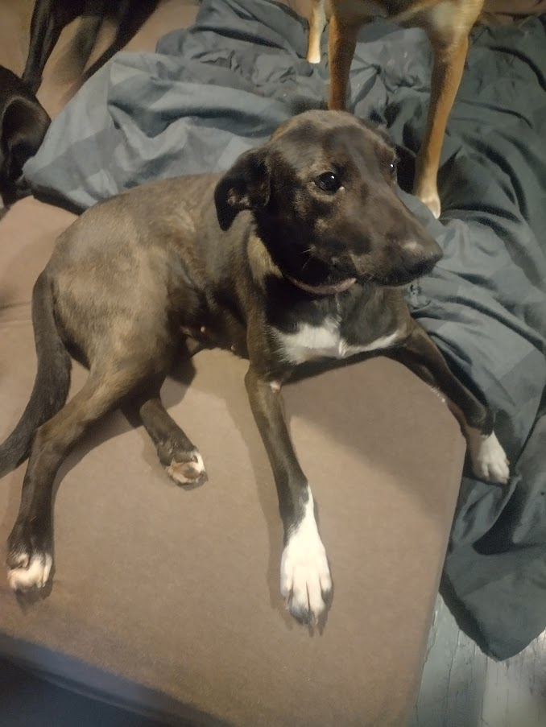

### Jenne

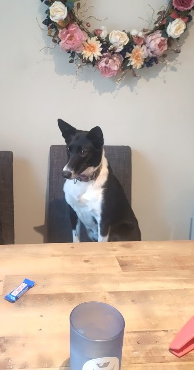

## Contact

seandewolski@duck.com
